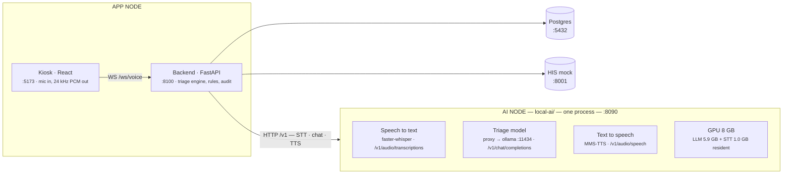

# On-prem triage stack — system design

Splitting the booth into two services: an **AI node** that owns the GPU and
speaks one port, and an **app node** that owns the patient, the database, and
the clinic.

| | |
|---|---|
| Cloud dependency | none |
| GPU | RTX 4060 Ti, 8 GB |
| AI node port | 8090 |
| Backend code changes | zero — config only |

---

## 1. Topology

Everything that needs the GPU goes in one folder behind one port. Everything
that needs the database, the HIS, and the patient stays where it is. The only
thing crossing between them is HTTP in the OpenAI audio/chat format — a
contract the backend already speaks.



The backend reaches all three engines through config alone —
`SCREENING_OPENAI_BASE_URL`, `STT_BASE_URL`, and `TTS_BASE_URL` all point at
`:8090`.

---

## 2. What the AI node serves

One FastAPI process, one port, three engines behind it. The routes are not
invented for this project — they are the OpenAI shapes that
`speech_adapter.py` and `model_adapter.py` already call, which is why the
backend needs no code change.

| Route | Engine | Runs on | Backend caller |
|---|---|---|---|
| `POST /v1/audio/transcriptions` | faster-whisper `medium` | GPU | `HttpSttClient` |
| `POST /v1/chat/completions` | proxy → Ollama `:11434` | GPU | `ChatOpenAI` |
| `POST /v1/audio/speech` | MMS-TTS (VITS) | CPU | `HttpTtsClient` |
| `GET /health` | model residency + VRAM | — | ops / startup gate |
| `GET /metrics` | per-turn latency, tok/s | — | ops |

### Why one port and not three

- **One thing to firewall.** The whole argument for on-prem is that patient
  audio and text never leave the building. One listening port is one rule to
  write and one rule to audit.
- **One health check.** The booth should refuse to open if any engine is cold.
  Three ports means three probes and three partial-failure states.
- **One place for the numbers.** Latency, tok/s, VRAM and realtime factors land
  in the same log, so a slow turn can be blamed on STT, the model, or TTS
  without correlating three services.
- **The engines are never concurrent anyway.** A turn is strictly sequential —
  transcribe, then think, then speak — so there is no throughput argument for
  separating them.

> **Design decision.** Ollama stays its own process on `:11434` and the gateway
> proxies to it, rather than loading the model in-process. Ollama already
> handles model residency, VRAM eviction and idle unloading; reimplementing
> that inside the gateway buys nothing. Bind it to localhost so `:8090` stays
> the only externally reachable AI port.

---

## 3. The GPU is the real constraint

Both the triage model and STT want the same 8 GB card. Measured on this
machine, with the 8B model resident and whisper `medium` loaded alongside it:

```
├──────────── Triage LLM 5.9 GB ────────────┤── STT 1.0 GB ──┤─ 1.1 GB free ─┤
0                                                                       8.0 GB
```

Measured total: **7033 MiB of 8188 MiB**. It fits, but the headroom is thin
enough that this should be treated as a hard budget, not a starting point.

- **TTS stays on CPU.** MMS-TTS already runs at 2.1× realtime there. Moving it
  to the GPU would spend scarce VRAM speeding up the one stage that is not the
  bottleneck.
- **A bigger model forces a choice.** Anything past 8B in 4-bit pushes STT back
  to CPU, which costs far more latency than the model gains in accuracy.
- **Pin the context window.** Ollama grows the KV cache with context; an
  unbounded window can quietly eat the 1.1 GB of headroom mid-call and evict
  whisper.

---

## 4. Where a turn's seconds go

Per patient turn, assuming a 5 s utterance and a 4 s spoken reply.

| Stage | Cost | Basis | Note |
|---|---:|---|---|
| End-of-turn detection | 2.50 s | config | `voice_silence_hang_ms`, tunable on site |
| Speech to text · CPU | ~5.00 s | **measured** | 1.0× realtime — 3.57 s for 3.6 s audio |
| Speech to text · GPU | unknown | **pending** | blocked on a CUDA library path, not yet timed |
| Extraction call | ~2.00 s | estimate | from measured 0.24 s TTFT + 50.3 tok/s |
| Question or explain call | ~2.00 s | estimate | second LLM call in the same turn |
| Text to speech | ~1.90 s | **measured** | 2.1× realtime on CPU |
| **Turn total, STT on CPU** | **~13.4 s** | — | silence to first audio out |

> **The number that decides the build.** Thirteen seconds between a patient
> finishing a sentence and the booth answering is not a conversation. Getting
> STT onto the GPU is the single highest-value change, and it is why the VRAM
> budget above is drawn the way it is. Two further levers, in order: stream the
> reply into TTS so audio starts on the first sentence instead of the last, and
> drop the silence window once real patients have been observed.

---

## 5. Port map

This machine is already busy. Three of the defaults in `.env.example` and the
project READMEs collide with services running right now, so the map has to be
explicit rather than assumed.

| Port | Service | Status |
|---|---|---|
| `8090` | AI node gateway | free — chosen |
| `11434` | Ollama, bind to localhost | free — internal only |
| `8100` | Triage backend | free — moved off 8000 |
| `5173` | Kiosk frontend | free |
| `5432` | Postgres + pgvector | running |
| `8001` | HIS mock | running |
| `8000` | **taken — license-plate detector** | ⚠ conflict, backend default |
| `8080` | **taken — Tomcat app** | ⚠ conflict, STT default |
| `8081` | **taken — Spring app** | ⚠ conflict, TTS default |

The backend's documented default of `:8000` is occupied by an unrelated CCTV
container. Moving the backend to `:8100` costs one flag and avoids a confusing
startup failure.

---

## 6. Repo layout

The AI node becomes one folder with its own venv, models and process. Nothing
inside it imports from the backend, and the backend never imports from it — the
only coupling is the HTTP contract.

```
# the AI node — everything GPU-bound, one port
local-ai/
  server.py          # gateway: routes + timing + /health
  engines/
    stt.py           # faster-whisper
    tts.py           # MMS-TTS, resamples 16k -> 24k
    llm.py           # streaming proxy to Ollama
  requirements.txt
  README.md

# the app node — unchanged
hospital-hotline-assistant-api/    :8100
hospital-hotline-assistant-web/    :5173
```

The backend is pointed at the AI node entirely through `.env`:

```ini
SCREENING_MODEL_PROVIDER=openai_compatible
SCREENING_OPENAI_BASE_URL=http://localhost:8090/v1
SCREENING_MODEL_NAME=scb10x/llama3.1-typhoon2-8b-instruct

STT_PROVIDER=openai_compatible
STT_BASE_URL=http://localhost:8090/v1

TTS_PROVIDER=openai_compatible
TTS_BASE_URL=http://localhost:8090/v1
# the TTS request carries no language field — the voice name selects it
TTS_LOCAL_VOICE_TH=th
TTS_LOCAL_VOICE_EN=en
```

Replacing `localhost` with a hostname is the whole of moving the AI node to a
second machine later — a bigger GPU box in the server room, with the kiosk PC
keeping only the browser and the backend.

---

## 7. What happens when a piece dies

Consolidating three engines behind one port also consolidates the blast radius,
so each mode needs a defined behaviour rather than a stack trace in front of a
patient.

| Failure | Effect today | Designed response |
|---|---|---|
| AI node down | every turn errors | kiosk refuses to start a session, shows the desk-staff card; `/health` gates the booth |
| Model evicted mid-call | one slow turn, then recovery | keep-alive on the Ollama model so it never unloads during clinic hours |
| Extraction returns nothing | retry, then nurse escalation | already correct — the rules engine never guesses a level |
| TTS wrong sample rate | backend raises | already correct — loud failure beats a chipmunk voice to a patient |
| STT returns empty | turn discarded | already handled; re-prompt after two consecutive empties |

---

## 8. Open risks this design does not solve

### The 8B model drops scalar fields

Probing the real extraction schema against five utterances, the model reliably
produced correct `finding_updates` and never hallucinated a key — but returned
`null` for `pain_score`, `age_years` and `gender` even when the patient stated
them plainly. In one Thai case it put the pain score into `slot_updates` as an
integer, where the schema declares strings, which Pydantic will reject.

The architecture contains the damage: because triage levels come from the rules
engine and never from the model, a missed extraction makes the interview
*longer*, not *wrong* — the completeness gate simply asks again. That is the
decision-separation rule earning its keep. It still needs quantifying with
`scripts/run_extraction_eval.py` before the 8B is accepted.

### Thai TTS is a downgrade

Piper has no Thai voice at all, so MMS-TTS is the only practical local option.
It is intelligible — synthesized Thai round-tripped back through whisper
verbatim — but noticeably more robotic than the Chirp3-HD voice it replaces. It
also reads digits and Latin text poorly, so numbers spoken to patients should
be spelled out in Thai words before reaching it.

### One machine, one booth

This design serves a single kiosk. A second booth sharing the AI node would put
two turns on one GPU at once, and the sequential-stage assumption behind the
VRAM budget stops holding. That is a real second-phase question, not a detail.

---

*Measurements taken on the booth workstation — RTX 4060 Ti 8 GB, 20 cores,
62 GB RAM — against Typhoon 8B via Ollama, faster-whisper medium and MMS-TTS.
Figures marked estimate or pending are not yet verified on hardware.*
