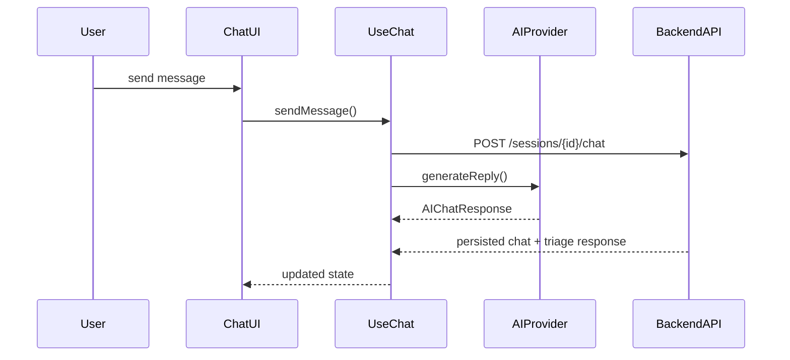

# AI Integration Guide

This document describes how the AI engineer should connect real speech and chat services to the hospital hotline frontend.

## Architecture

The frontend calls **one abstraction only**: `AIProvider.generateReply()` in [`src/ai/types.ts`](src/ai/types.ts).

The chat hook [`src/hooks/useChat.ts`](src/hooks/useChat.ts) is the single integration point. UI components never call AI services directly.



## Request contract

```typescript
interface AIChatRequest {
  sessionId: string;
  language: 'th' | 'en';
  inputMode: 'voice' | 'text';
  userMessage: string;
  history: MessageOut[];
}
```

## Response contract

The response maps directly to existing FastAPI POST bodies:

```typescript
interface AIChatResponse {
  reply: string;
  severity?: {
    level: 'emergency' | 'urgent' | 'general' | 'unknown';
    explanation?: string;
    confidence?: number;
  };
  department?: {
    departmentId: string;  // UUID from GET /departments
    reason?: string;
    confidence?: number;
  };
  emergency?: {
    triggerId?: string;    // UUID from GET /emergency-triggers
    alertMessage: string;
    detectedSymptoms?: string[];
  };
  symptoms?: {
    rawText: string;
    bodyLocation?: string;
    durationText?: string;
  };
  modelName?: string;
  latencyMs?: number;
}
```

## Provider options

Configure via `.env`:

| Variable | Values | Purpose |
|----------|--------|---------|
| `VITE_AI_PROVIDER` | `http` (default), `stub`, `openai` | Select provider implementation |
| `VITE_AI_CHAT_URL` | URL template | Used when `VITE_AI_PROVIDER=http` |
| `VITE_ENABLE_VOICE` | `true` / `false` | Enable browser STT mic button |

### Stub provider (current default)

File: [`src/ai/providers.ts`](src/ai/providers.ts)

Returns localized placeholder text. Demo emergency response when user mentions "chest pain" or "เจ็บหน้าอก".

### HTTP provider (recommended for backend AI)

Set:

```env
VITE_AI_PROVIDER=http
VITE_AI_CHAT_URL=http://localhost:8000/sessions/{sessionId}/chat
```

Expected request body:

```json
{
  "content": "I have chest pain",
  "input_mode": "text",
  "language": "en",
  "history": []
}
```

Expected response: `AIChatResponse` shape above.

### Backend endpoint (implemented)

```
POST /sessions/{session_id}/chat
```

The backend now:

1. Load session context and routing rules (`GET /routing-rules`, `/emergency-triggers`, `/departments`)
2. Run LLM + severity/department logic
3. Persist messages, symptoms, assessments, recommendations, and emergency events
4. Return `AIChatResponse` to the frontend

The frontend now treats this endpoint as the primary orchestration path.

## Speech integration

| Hook | File | Purpose |
|------|------|---------|
| `useSpeechRecognition` | [`src/hooks/useSpeech.ts`](src/hooks/useSpeech.ts) | Browser Web Speech API STT |
| `useSpeechSynthesis` | [`src/hooks/useSpeech.ts`](src/hooks/useSpeech.ts) | Browser TTS for assistant replies |

To enable mic input:

```env
VITE_ENABLE_VOICE=true
```

For production-quality Thai/English STT/TTS, replace or wrap these hooks with calls to your chosen cloud service (OpenAI Whisper, Google Cloud Speech, Azure, etc.).

## Reference backend data

The AI layer can prefetch:

- `GET /departments` — department UUIDs and names
- `GET /routing-rules` — keyword/condition routing logic
- `GET /emergency-triggers` — emergency keyword rules and alert messages

## Files to modify for AI integration

1. [`src/ai/providers.ts`](src/ai/providers.ts) — add `OpenAIProvider` or extend `HttpAIProvider`
2. [`src/hooks/useSpeech.ts`](src/hooks/useSpeech.ts) — swap browser APIs for cloud STT/TTS
3. Optionally simplify [`src/hooks/useChat.ts`](src/hooks/useChat.ts) if backend chat endpoint handles all persistence

Do **not** modify UI components unless adding new display fields.
