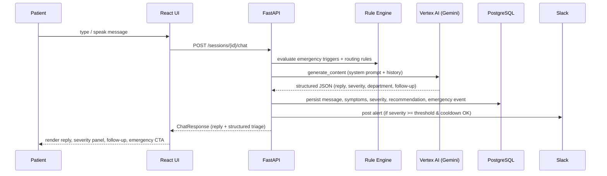
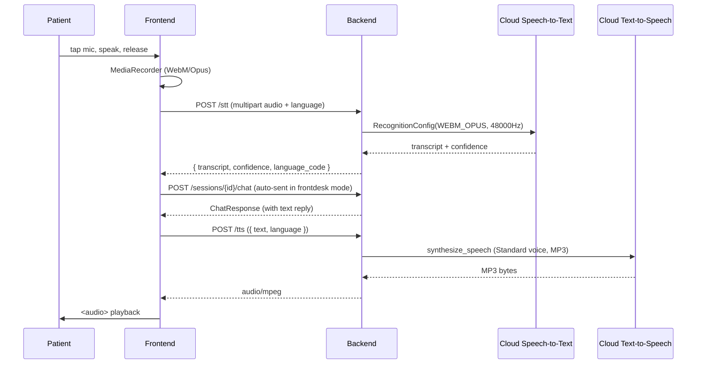

# AI Integration Guide

> **Status (May 2026):** AI orchestration runs **entirely in the backend**. The frontend has no AI provider abstraction — it simply POSTs to `/sessions/{sessionId}/chat` and renders the structured response.

## Architecture



## Frontend integration point

[`src/hooks/useChat.ts`](src/hooks/useChat.ts) — the only place that talks to the chat endpoint:

```ts
const response = await api.chat(sessionId, {
  content: trimmed,
  input_mode: inputMode,
  language,
  history: [],
});
```

The hook maps the backend's snake_case `ChatResponsePayload` into a camelCase `ChatAssessment` for UI components. No other frontend file knows or cares about AI.

If you need to display a new field from the backend response, add it to `ChatResponsePayload` in [`src/api/types.ts`](src/api/types.ts) and map it inside `toAssessment()` in `useChat.ts`.

## Backend AI stack

| Module | File | Purpose |
|---|---|---|
| Triage orchestrator | [`app/services/triage_service.py`](../hospital-hotline-assistant-api/app/services/triage_service.py) | Runs rule engine, calls LLM, persists everything, fires Slack alerts |
| LLM client | [`app/services/google_ai.py`](../hospital-hotline-assistant-api/app/services/google_ai.py) | `GoogleTriageClient` using `google-genai` against Vertex AI |
| Rule engine | [`app/services/rule_engine.py`](../hospital-hotline-assistant-api/app/services/rule_engine.py) | Deterministic keyword/condition matching for emergency triggers + routing rules |
| Slack notifier | [`app/services/slack_notifier.py`](../hospital-hotline-assistant-api/app/services/slack_notifier.py) | Webhook poster with threshold + cooldown |
| Department prompt context | [`app/data/departments.json`](../hospital-hotline-assistant-api/app/data/departments.json) | Department code → name + sample symptoms (fed into the LLM system prompt) |

### Backend `.env` (Vertex AI section)

```env
GOOGLE_AI_ENABLED=true
GOOGLE_CLOUD_PROJECT=your-gcp-project-id
GOOGLE_CLOUD_LOCATION=us-central1
GOOGLE_MODEL_NAME=gemini-2.5-flash
GOOGLE_APPLICATION_CREDENTIALS=phoenix_gcp_credentials.json  # relative to api dir, or absolute
```

Service account needs `roles/aiplatform.user` and `aiplatform.googleapis.com` enabled on the project. The credential JSON file is gitignored via the `*credentials.json` pattern in the root `.gitignore`.

When `GOOGLE_AI_ENABLED=false` or the LLM errors, the client falls back to a localized stub response — the rule engine still produces a correct emergency classification independently, so safety is preserved.

## Frontend `.env`

```env
VITE_API_BASE_URL=http://localhost:8000
VITE_ENABLE_VOICE=false
VITE_FRONTDESK_MODE=true
```

That's it — no more `VITE_AI_PROVIDER` / `VITE_AI_CHAT_URL`. Anything AI-related is configured backend-side.

## Speech integration (push-to-talk loop)

Both STT and TTS now go through the backend so secrets stay server-side and Thai quality is good.



| Hook | File | Behavior |
|---|---|---|
| `useSpeechRecognition` | [`src/hooks/useSpeech.ts`](src/hooks/useSpeech.ts) | `MediaRecorder` → `audio/webm;codecs=opus` → POST `/stt` → `{ transcript, confidence, language_code }` |
| `useSpeechSynthesis` | [`src/hooks/useSpeech.ts`](src/hooks/useSpeech.ts) | POST `/tts` → `audio/mpeg` blob → `<Audio>` element playback |

### Backend endpoints

| Endpoint | Body | Response |
|---|---|---|
| `POST /tts` | `{ "text": "...", "language": "en"\|"th" }` | `audio/mpeg` (MP3 bytes) |
| `POST /stt` | multipart: `audio` (Blob) + `language` (`en`\|`th`) | `{ "transcript": "...", "confidence": 0.93, "language_code": "en-US" }` |

### Voices used (Standard tier — ~$4 / 1M chars)

| Language | Voice |
|---|---|
| English | `en-US-Standard-C` (female) |
| Thai | `th-TH-Standard-A` (female) |

To upgrade to Neural2/Studio, edit `_VOICE_BY_LANGUAGE` in [`app/services/google_tts.py`](../hospital-hotline-assistant-api/app/services/google_tts.py).

### One-time GCP setup (in addition to Vertex AI)

```bash
gcloud services enable texttospeech.googleapis.com speech.googleapis.com
gcloud projects add-iam-policy-binding $PROJECT \
  --member="serviceAccount:$SA_EMAIL" --role="roles/cloudtts.user"
gcloud projects add-iam-policy-binding $PROJECT \
  --member="serviceAccount:$SA_EMAIL" --role="roles/speech.client"
```

The same `phoenix_gcp_credentials.json` service-account key is reused for Vertex AI, TTS, and STT.

## Adding a new field

1. Backend: add it to `ChatResponse` in [`app/schemas.py`](../hospital-hotline-assistant-api/app/schemas.py) and the `TriageResult` → response mapping in [`app/main.py`](../hospital-hotline-assistant-api/app/main.py).
2. Frontend: add the snake_case key to `ChatResponsePayload` in [`src/api/types.ts`](src/api/types.ts), then map it inside `toAssessment()` in [`src/hooks/useChat.ts`](src/hooks/useChat.ts).
3. Render it in [`src/pages/ChatPage.tsx`](src/pages/ChatPage.tsx) or [`src/components/RecommendationCard.tsx`](src/components/RecommendationCard.tsx).
